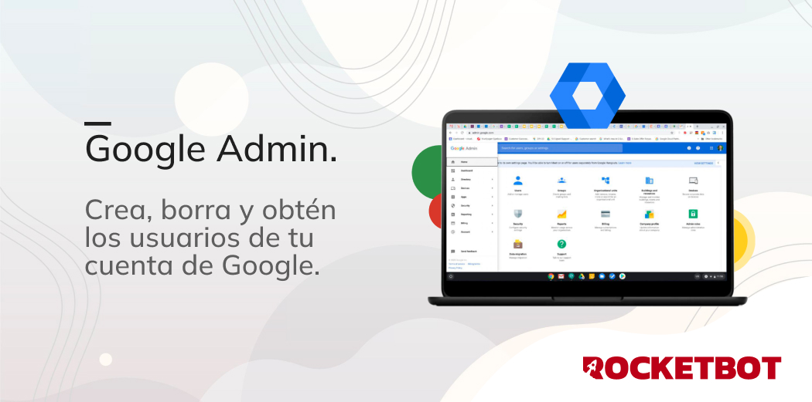

# Google Admin
  
Este módulo de conecta a la Api Directory de google. Puedes Crear, eliminar o restaurar la contraseña de un Usuario  
  

## Como instalar este modulo
  
__Descargue__ e __instale__ el contenido en la carpeta 'módulos' en la ruta de Rocketbot

## Como usar este modulo

Para utilizar este módulo necesitas habilitar la API de Google Admin para tu cuenta. Para ello, debes seguir los siguientes pasos ( [referencia](https://developers.google.com/admin-sdk/directory/v1/quickstart/python) ):

- Crear un projecto en Google Cloud Console (Saltar si ya tienes un proyecto creado)
  - En el menú de la izquierda, dar click en **Menu** > **IAM & Admin** > **Create a project**.
  - En el campo **Project Name**, agregar un nombre para el proyecto
  - Completar los siguientes campos según corresponda

- Habilitar la API:
    - Ir a [Google Cloud Console](https://console.cloud.google.com/)
    - En el menú arriba a la derecha, dar click en **Menu** > **APIs & Services** > **Library**
    - En el buscador, buscar **Admin SDK API**
    - Dar click en el resultado **Admin SDK API**
    -  Click en el botón **Enable**

- Crear credenciales de Google:
    - Ir a [Google Cloud Console](https://console.cloud.google.com/)
    - En el menú arriba a la derecha, dar click en **Menu** > **APIs & Services** > **Credentials**
    - Click en el botón **Create credentials**
    - Click en **OAuth client ID**
    - En el campo **Application type**, seleccionar **Desktop Application**
    - Escribir un nombre en el campo **Name**
    - Aparecerá una ventana con los datos de la credencial. Dar click en **Download JSON**
    - Utilizar este archivo como credenciales en el módulo

## Descripción de los comandos

### Configurar credenciales G-Suite
  
Configura credenciales para conectar con el API de Google Admin.
|Parámetros|Descripción|ejemplo|
| --- | --- | --- |
|Ruta archivo de credenciales|Archivo json con las credenciales de acceso a la API de Google Admin. Revisar la documentación para obtener más información.|C:\Usuario\Desktop\credenciales.json|
|Asignar resultado a variable|Nombre de la variable donde se asignará el resultado de la execución del comando.|result|

### Crear un nuevo usuario
  
Este comando crea un nuevo usuario en el directorio de google. El usuario será creado con el email y contraseña 
especificados.
|Parámetros|Descripción|ejemplo|
| --- | --- | --- |
|Nombre|Nombre del usuario a crear|Juan|
|Apellido|Apellido del usuario a crear|Perez|
|Asignar resultado a variable|Nombre de la variable donde almacenar el resultado del comando|resultado|
|Correo|Correo del usuario a crear|juan.perez@mail.com|
|Contraseña|Contraseña del usuario a crear. Si no se especifica, se generará una contraseña aleatoria|123456789|
|Datos adicionales|Datos adicionales a ser agregados al usuario. Mas información aquí https//developers.google.com/admin-sdk/directory/reference/rest/v1/users/insert|{"isAdmin": True, "recoveryEmail": "r2d2@gmail.com"}|

### Obtener usuarios
  
Obtener usuarios de Google. Puedes añadir un filtro para obtener solo usuarios con un dominio de correo electrónico 
específico.
|Parámetros|Descripción|ejemplo|
| --- | --- | --- |
|Dominio (opcional)|Filtrar usuarios por dominio de correo electrónico.|@rocketbot.com|
|Nombre de la variable donde almacenar el resultado del comando|Nombre de la variable donde almacenar el resultado del comando|resultado|
|Ordenar por (opcional)|Ordenar usuarios por este campo. Si no seleccionas ningún campo, los usuarios se ordenarán por email.|email|
|Ascendente o Descendente|Ordenar usuarios de forma ascendente o descendente.|ASCENDING|
|Datos adicionales|Datos adicionales a ser agregados al usuario. Mas información aquí https//developers.google.com/admin-sdk/directory/reference/rest/v1/users/list|{"maxResults": 10, "viewType": "domain_public", ...}|

### Borrar usuario
  
Borrar un usuario de Google Admin
|Parámetros|Descripción|ejemplo|
| --- | --- | --- |
|Key de Usuario|Key de Usuario o Email Address del usuario a ser borrado|111575529871886135722 o juan.perez@mail.com|
|Nombre de la variable donde almacenar el resultado|Nombre de la variable donde almacenar el resultado del comando|resultado|
|Datos adicionales|Datos adicionales a ser enviados a la API. Mas info https//developers.google.com/admin-sdk/directory/reference/rest/v1/users/delete|{"viewType": "domain_public", ...}|

### Obtener usuario
  
Obtener la información de un usuario de Google Admin
|Parámetros|Descripción|ejemplo|
| --- | --- | --- |
|Key de Usuario|El key de usuario puede ser el correo electrónico primario del usuario o su ID único. Listar los usuarios para conocer su key de usuario|111575529871886135722 o juan.perez@mail.com|
|Nombre de la variable donde almacenar el resultado|Nombre de la variable donde almacenar el resultado del comando|resultado|
|Datos adicionales|Datos adicionales a ser enviados junto con la solicitud. Más información https//developers.google.com/admin-sdk/directory/reference/rest/v1/users/get|{"viewType": "domain_public", ...}|

### Actualizar usuario
  
Actualizar la información de un usuario de Google Admin
|Parámetros|Descripción|ejemplo|
| --- | --- | --- |
|Key de Usuario|El key de usuario puede ser el correo electrónico primario del usuario o su ID único. Listar los usuarios para conocer su key de usuario|111575529871886135722 o juan.perez@mail.com|
|Nombre de la variable donde almacenar el resultado|Nombre de la variable donde almacenar el resultado del comando|resultado|
|Correo|Correo del usuario a crear|juan.perez@mail.com|
|Contraseña|Contraseña del usuario a crear. Si no se especifica, se generará una contraseña aleatoria|123456789|
|Datos adicionales|Datos adicionales a ser enviados junto con la solicitud. Más información https//developers.google.com/admin-sdk/directory/reference/rest/v1/users/patch|{"viewType": "domain_public", ...}|
